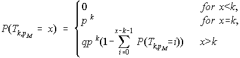

# TRF
**Tandem Repeats Finder:** https://tandem.bu.edu/trf/trf.html  
**Tandem Repeats Database:** http://tandem.bu.edu/cgi-bin/trdb/trdb.exe

## Table of Contents ##
 - [Purpose](#purpose)   
 - [Reference](#reference)
 - [Authors](#authors)
 - [License](#license)
 - [Pre-compiled Versions](#pre-compiled-versions)
 - [Instructions for Compiling](#instructions-for-compiling) 
 - [Quick Start](#quick-start)
 - [Using Command Line Version of Tandem Repeats Finder](#using-command-line-version-of-tandem-repeats-finder)  
 - [TRF Definitions](#trf-definitions)  
 	- [FASTA Format](#fasta-format)
    - [Table Explanation](#table-explanation)
    - [Alignment Explanation](#alignment-explanation)
 - [How does Tandem Repeats Finder work?](#how-does-tandem-repeats-finder-work)  
 - [What's New](#whats-new)

## Purpose ## 

## Reference ##
Benson G. **Tandem repeats finder: a program to analyze DNA sequences.** ***Nucleic Acids Res.*** 1999; 27(2):573–580. [doi:10.1093/nar/27.2.573](https://academic.oup.com/nar/article/27/2/573/1061099)

## Authors ##
Gary Benson  
Yozen Hernandez  
Yevgeniy Gelfand   
Alfredo Rodriguez  

## License ##

## Pre-compiled Versions ##
Current and/or earlier, pre-compiled versions of TRF can be found by:
 - locating and clicking on the `releases` tab at the top of this page
 - checking in each of the listed releases for executable files
 

## Instructions for Compiling ##

To compile TRF:
 - Open a terminal window and change directory to the TRF directory created by a clone of this repository.
 - Type `make` in the terminal.  
 
This will:
 - compile the code
 - create a `build/` directory
 - place the executable version in the build directory.  
 
The file will be called `trf<version>.<operating system>.exe`.  
For example the file on a linux 64 bit operating system for version 4.10.0 will be called `trf4.10.0.linux64.exe`

 

## Quick Start ##
The following is a recommended command line to run TRF.  Parameters are explained further below. This assumes the executable has been renamed `trf`.
```bash
trf yourfile.fa 2 5 7 80 10 50 2000
```
## Using Command Line Version of Tandem Repeats Finder ##

Once the program is installed you can run it with no parameters to obtain information on proper usage syntax.

If you installed the program as trf then by typing trf at the command line you will see the following output: 

```bash
Please use: trf File Match Mismatch Delta PM PI Minscore MaxPeriod [options]

Where: (all weights, penalties, and scores are positive)
  File = sequences input file
  Match  = matching weight
  Mismatch  = mismatching penalty
  Delta = indel penalty
  PM = match probability (whole number)
  PI = indel probability (whole number)
  Minscore = minimum alignment score to report
  MaxPeriod = maximum period size to report
  [options] = one or more of the following:
        -m        masked sequence file
        -f        flanking sequence
        -d        data file
        -h        suppress html output
        -r        no redundancy elimination
        -l <n>    maximum TR length expected (in millions) (eg, -l 3 or -l=3 for 3 million)
```
Note the sequence file should be in FASTA format:

```bash
>Name of sequence
aggaaacctgccatggcctcctggtgagctgtcctcatccactgctcgctgcctctccag
atactctgacccatggatcccctgggtgcagccaagccacaatggccatggcgccgctgt
actcccacccgccccaccctcctgatcctgctatggacatggcctttccacatccctgtg
```
The program accepts a minimum of eight parameters. Options can be specified to generate additional files.

The following is a more detailed description of the **parameters**:

- **File:** The sequence file to be analyzed in FASTA format (see for details). Multiple sequence in the same file are allowed.
 - **Match, Mismatch, and Delta:** Weights for match, mismatch and indels. These parameters are for Smith-Waterman style local alignment using wraparound dynamic programming. Lower weights allow alignments with more mismatches and indels. A match weight of 2 has proven effective with mismatch and indel penalties in the range of 3 to 7. Mismatch and indel weights are interpreted as negative numbers. A 3 is more permissive and a 7 less permissive. The recomended values for Match Mismatch and Delta are 2, 7, and 7 respectively.
 - **PM and PI:** Probabilistic data is available for PM values of 80 and 75 and PI values of 10 and 20. The best performance can be achieved with values of PM=80 and PI=10. Values of PM=75 and PI=20 give results which are very similar, but often require as much as ten times the processing time when compared with values of PM=80 and PI=10.
 - **Minscore:** The alignment of a tandem repeat must meet or exceed this alignment score to be reported. For example, if we set the matching weight to 2 and the minimun score to 50, assuming perfect alignment, we will need to align at least 25 characters to meet the minimum score (for example 5 copies with a period of size 5).
 - **Maxperiod:** Period size is the program's best guess at the pattern size of the tandem repeat. The program will find all repeats with period size between 1 and 2000, but the output can be limited to a smaller range.
 - **-m:** This is an optional parameter and when present instructs the program to generate a masked sequence file. The masked sequence file is a FASTA format file containing a copy of the sequence with every location that occurred in a tandem repeat changed to the letter 'N'. The word "masked" is added to the sequence description line just after the '>' character.
 - **-f:** If this option is present, flanking sequence around each repeat is recorded in the alignment file. This may be useful for PCR primer determination. Flanking sequence consists of the 500 nucleotides on each side of a repeat.
 - **-d:** A data file is produced if this option is present. This file is a text file which contains the same information, in the same order, as the summary table file, plus consensus pattern and repeat sequences. This file contains no labeling and is suitable for additional processing, for example with a perl script, outside of the program.
 - **-h:** suppress HTML output (this automatically switches -d to ON)
 - **-l \<n\>:** Specifies that the longest TR array expected in the input is at most n million bp long. The default is 2 (for 2 million). Setting this option too high may result in an error message if you did not have enough availablememory. We have only tested this option uo to value 29.
 - **-u:** Prints the help/usage message above
 - **-v:** Prints the version information
 - **-ngs:** More compact .dat output on multisequence files, returns 0 on success. You may pipe input in with this option using - for file name. Short 50 flanks are appended to .dat output. .dat output actually goes to stdout instead of file. Sequence headers are displayed in output as @header. Only headers containing repeats are shown. 

Using recommended parameters the command line will look something like:  
```
 trf yoursequence.txt 2 7 7 80 10 50 500 -f -d -m
```
Once the program starts running it will print update messages to the screen. The word "Done" will be printed when the program finishes.

For single sequence input files there will be at least two HTML format output files, a repeat table file and an alignment file. If the number of repeats found is greater than 120, multiple linked repeat tables are produced. The links to the other tables appear at the top and the bottom of each table. To view the results start by opening the first repeat table file with your web browser. This file has the extension ".1.html". Alignment files can be accessed from the repeat table files. Alignment files end with the ".txt.html" extension.

For input files containing multiple sequences a summary page is produced that links to the output of individual sequences. This file has the extension "summary.html". You should start by opening this file if your input had multiple sequences in the same file. Also note that the output files of individual sequences will have an identifier of the form ".sn." ( n an integer) embedded in the name indicating the index of the sequence in the input file. The identifier is omitted for single sequence input files. 

For more information on the output please see [Table Explanation](#table-explanation) and [Alignment Explanation](#alignment-explanation). 

## TRF Definitions ##

### FASTA Format: ###

The FASTA format is a plain text format which looks something like this:

```
>myseq  
AGTCGTCGCT AGCTAGCTAG CATCGAGTCT TTTCGATCGA GGACTAGACT TCTAGCTAGC  
TAGCATAGCA TACGAGCATA TCGGTCATGA GACTGATTGG GCTTTAGCTA GCTAGCATAG 
CATACGAGCA TATCGGTAGA CTGATTGGGT TTAGGTTACC
```

The first line starts with a greater than sign ">" and contains a name or other identifier for the sequence. This is the sequence header and must be in a single line. The remaining lines contain the sequence data. The sequence can be in upper or lower case letters. Anything other than letters (numbers for example) is ignored. Multiple sequences can be present in the same file as long as each sequence has its own header.  

### Table Explanation: ### 

The summary table includes the following information:

1. Indices of the repeat relative to the start of the sequence.
2. Period size of the repeat.
3. Number of copies aligned with the consensus pattern.
4. Size of consensus pattern (may differ slightly from the period size).
5. Percent of matches between adjacent copies overall.
6. Percent of indels between adjacent copies overall.
7. Alignment score.
8. Percent composition for each of the four nucleotides.
9. Entropy measure based on percent composition. 

If the output contains more than 120 repeats, multiple linked tables are produced. The links to the other tables appear at the top and bottom of each table.

Note: If you save multiple linked summary table files, use the default names supplied by your browser to preserve the automatic linking.

### Alignment Explanation: ### 

The alignment is presented as follows:

1. In each pair of lines, the actual sequence is on the top and a consensus sequence for all the copies is on the bottom.
2. Each pair of lines is one period except for very small patterns.
3. The 10 sequence characters before and after a repeat are shown.
4. Symbol * indicates a mismatch.
5. Symbol - indicates an insertion or deletion.
6. Statistics refers to the matches, mismatches and indels overall between adjacent copies in the sequence, not between the sequence and the consensus pattern.
7. Distances between matching characters at corresponding positions are listed as distance, number at that distance, percentage of all matches.
8. ACGTcount is percentage of each nucleotide in the repeat sequence.
9. Consensus sequence is shown by itself.
10. If chosen as an option, 500 characters of flanking sequence on each side of the repeat are shown. 

Note: If you save the alignment file, use the default name supplied by your browser to preserve the automatic cross-referencing with the summary table.


## How does Tandem Repeats Finder work? ##
### Probabilistic Model of Tandem Repeats ###

We model *alignment* of two tandem copies of a pattern of length n by a sequence of n independent Bernoulli trials (coin-tosses). The probability of success, *P(Heads)*, which we also call *P<sub>M</sub>* or *matching probability*, represents the *average* percent identity between the copies. Each head in the Bernoulli sequence is interpreted as a match between aligned nucleotides. Each tail is a mismatch, insertion or deletion. A second probability, *P<sub>I</sub>* or *indel probability*, specifies the average percentage of insertions and deletions between the copies. Figure 1 illustrates the underlying idea for the model.


We are interested in the distribution of Bernoulli sequences and the properties of alignments that they represent when dealing with a specific pair *(P<sub>M</sub>, P<sub>I</sub>)*, for example, *(P<sub>M</sub> = .80, P<sub>I</sub> = .10)*. Note that these *conservation parameters* serves as a type of extremal bound, i.e., as a quantitative description of the *most divergent copies* we hope to detect.


### Program Outline ###

The program has *detection* and *analysis* components. The detection component uses a set of statistically based criteria to find *candidate* tandem repeats. The analysis component attempts to produce an alignment for each candidate and if successful gathers a number of statistics about the alignment (percent identity, percent indels) and the nucleotide sequence (composition, entropy measure).

### Detection Component ###

We assume that adjacent copies of any pattern will contain some matching characters in corresponding positions. Just how many matches and how the distance between those matches should vary depend on the fixed values of *P<sub>M</sub>* and *P<sub>I</sub>*. We use statistical criteria to answer these questions.

The algorithm looks for matching nucleotides separated by a common distance *d*, which is not specified in advance. For reasons of efficiency it looks for *runs of k matches*, which we call *k-tuple matches*. A *k-tuple* is a window of *k* consecutive characters from the nucleotide sequence. Matching *k-tuples* are two windows with identical contents and if aligned in the Bernoulli model would produce a run of *k* heads. Because we limit ourselves to *k-tuple matches*, we will *not* detect all matching characters. For example, if *k=6* and two windows contain TCATGT and TCTTGT we will *not* know that there are 5 matching characters because the window contents are not identical. Put in terms of the Bernoulli model, the aligned windows would be represented by the sequence HHTHHH which is *not* a run of 6 heads.

The basic operation of the detection component is illustrated in the figure below. Let *S* be a nucleotide sequence. We select a small integer *k*, for the tuple or window size (*k=5* for example) and keep a list of all possible *k*-length strings (there are *4<sup>k</sup>* for the DNA alphabet {A,C,G,T}) which we call the probes. By sliding the window across the sequence, we determine the probe at each position *i* in *S*. For each probe *p*, we maintain a history list, *H<sub>p</sub>*, of the positions at which *p* occurs.

When a position *i* is added to *H<sub>p</sub>*, we scan *H<sub>p</sub>* for all earlier occurrences of *p*. Let one earlier occurrence be at *j*. Since *i* and *j* are the indices of matching *k-tuples*, the distance *d=i-j* is a *possible pattern size* for a tandem repeat. For the criteria tests, we need information about other *k-tuple* matches at the same distance *d* where the leading tuple occurs in the sequence between *j* and *i*. A *distance list*, *D<sub>d</sub>*, stores this information. It can be thought of as a sliding window of length *d* which keeps track of the positions of matches and their total.

List *D<sub>d</sub>* is updated every time a match at distance *d* is detected. Position *i* of the match is stored on the list and the total is increased. The right end of the window is set to *i* and matches that occurred before *j=i-d* are dropped from the list and subtracted from the total. Lists for other nearby distances are also updated at this time (see [Random Walk Distribution](#random-walk-distribution)), but only to reset their right ends to *i* and remove matches that have been passed by the advancing windows. Information in the updated distance lists is used for the [sum-of-heads](#sum-of-heads) and [apparent-size](#apparent-size-distribution) criteria tests. If both tests are successful, the program moves on to the analysis component.


### Statistical Criteria ###

The statistical criteria are based on runs of heads in Bernoulli sequences, corresponding to matches detected with the *k-tuples* and stored in the distance lists. The criteria are based on four distributions which depend upon 1) the pattern length, *d*, 2) the matching probability, *P<sub>M</sub>*, 3) the indel probability, *P<sub>I</sub>*, and 4) the tuple size, *k*. For each distribution, we either calculate it with a formula or estimate it using simulation. Then, we select a cutoff value that serves as our criterion.

### Sum of Heads Distribution ###

This distribution indicates how many matches are required for a specific distance or pattern length. Let the random variable *R<sub>d,k,P<sub>M</sub></sub>* = the total number of heads in head runs of length *k* or longer in an iid Bernoulli sequence of length *d* with success probability *P<sub>M</sub>*. The distribution of *R<sub>d,k,P<sub>M</sub></sub>* is well approximated by the normal distribution and its exact mean and variance can be calculated in constant time. For the *sum-of-heads criterion*, we use the normal distribution to determine the largest number, *x*, such that 95% of the time *R<sub>d,k,P<sub>M</sub></sub>* ≥ x. For example, if *P<sub>M</sub> = .75*, *k* = 5 and *d* = 100, then the criterion is 26. Put another way, if a pattern has length 100 and aligned copies are expected to match in 75 positions, then by counting only matches that fill a window of length 5, we expect to count at least 26 matches 95% of the time.

### Random Walk Distribution ###

This distribution describes how distances between matches may vary due to indels. Because indels change the distance between matching *k-tuples* (figure below), there will be situations where the pattern has size *d*, yet the distance between matching *k-tuples* is *d±1*, *d±2*, etc. In order to test the sum-of-heads criterion, we count the matches in *D<sub>d±&Delta;d</sub>*, for *&Delta;d* = 0,1,...,*&Delta;d<sub>max</sub>* for some *&Delta;d<sub>max</sub>*. In our model, indels are single nucleotide events occurring with probability *P<sub>I</sub>. Insertions and deletions are considered equally likely and we treat the distance change as a problem of random walks. Let the random variable *W<sub>d,P<sub>I</sub></sub>* = the maximum displacement from the origin of a one dimensional random walk with expected number of steps equal to *P<sub>I</sub> &middot; d*. It can be shown that 95% of the time the random walk ranges between ± 2.3 &middot; &radic;(P<sub>I</sub> &middot; d). We set *&Delta;d<sub>max</sub> = floor(2.3 &middot; &radic;(P<sub>I</sub> &middot; d))*. For example if *P<sub>I</sub>* = 0.1 and *d* = 100, then *&Delta;d<sub>max</sub>* = 7.


### Apparent Size Distribution ###

This distribution is used to distinguish between tandem repeats and non-tandem direct repeats (figure below). For tandem repeats, the leading tuple in matching *k-tuples* will be distributed throughout the interval from *j* to *i*, whereas for non-tandem repeats, they should be concentrated on the right side of the interval near *i*. Let the random variable S<sub>d,k,P<sub>M</sub></sub> = the distance between the first and last run of *k* heads in an iid Bernoulli sequence of length *d* with success probability *P<sub>M</sub>*.

*S<sub>d,k,P<sub>M</sub></sub>* is the apparent size of the repeat when using *k-tuples* to find the matches and will usually be shorter than the pattern size *d*. We estimate the distribution of *S<sub>d,k,P<sub>M</sub></sub>* by simulation because we make it conditional on first meeting the sum-of-heads criterion. For given *d*, *k*, and *P<sub>M</sub>*, random Bernoulli sequences are generated using *P<sub>M</sub>*. For every sequence that meets or exceeds the sum-of-heads criteria, the distance between the first and last run of heads of length *k* or larger is recorded. From the distribution, we determine the maximum number *y* such that 95% of the time *S<sub>d,k,P<sub>M</sub></sub> > y*.  We use *y* as our *apparent size criterion*. For example, if *P<sub>M</sub>* = .75, *k* = 5 and *d* = 100, then the criterion is 56. In order to test the apparent-size criterion, we compute the distance between the first and last tuple on list *D<sub>d</sub>*. If the distance between the tuples is smaller than the criterion, we assume the repeat is not tandem or that we have not yet seen enough of it to be convinced.


### Waiting Time Distribution ###

This distribution is used to pick tuple sizes. Tuple size has a significant inverse effect on the running time of the program because increasing tuple size causes an exponential decrease in the expected number of tuple matches. If the nucleotides occur with equal frequency, then increasing the tuple size by *&Delta;k* increases the average distance between randomly matching tuples by a factor of *4<sup>&Delta;k</sup>*. If *k* = 5, the average distance between random matches is approximately 1Kb, but if *k* = 7, the average distance is approximately 16Kb. Thus, by using a larger tuple size, we keep the history lists short. On the other hand, increasing the tuple size decreases the chance of noticing approximate copies because they may not contain a long, unbroken run of matches. Let the random variable *T<sub>k,P<sub>M</sub></sub>* = the number of iid Bernoulli trials with success probability *P<sub>M</sub>* until the first occurrence of a run of *k* successes. *T<sub>k,P<sub>M</sub></sub>* follows the *geometric distribution of order k*. If we let *p* = *P<sub>M</sub>* and *q* = *1 - p*, then the exact probability *P(T<sub>k,P<sub>M</sub></sub> = x)* for *x* ≥ 0 is given by the recursive formula:



For example, if *P<sub>M</sub>* = .75 and *k* = 5 then we need at least 31 trials (coin-tosses) to have a 95% chance of seeing a run of 5 heads. For patterns smaller than 31 characters, we need to use a smaller *k-tuple*. The waiting time distribution allows us to balance the running time and sensitivity of our algorithm by picking a set of tuple sizes, *each applying to a different range of pattern sizes*. The program processes the sequence once, simultaneously checking these different tuple sizes. We require that the smallest pattern for tuple size *k* have a sum-of-heads criterion of at least k+1. The table below shows the range of tuple sizes and the corresponding pattern sizes currently used by the program.


### Analysis Component ###

If the information in the distance list passes the criteria tests, a candidate pattern consisting of positions *j+1...i*, is selected from the nucleotide sequence and aligned with the surrounding sequence using wraparound dynamic programming (WDP). If at least two copies of the pattern are aligned with the sequence, the tandem repeat is reported. Several implementation details of the analysis component are described below.

***Multiple Reporting of Repeat at Different Pattern Sizes :***

When a single tandem repeat contains many copies, several pattern sizes are possible. For example, if the basic pattern size is 26, then the repeat may be reported at sizes 26, 52, 78, etc. We limit this redundancy in the output to, at most, three pattern sizes. Note that we do not automatically limit the output to the smallest period size because a much better alignment may come from a larger size.

***Narrow Band Alignment :***

Alignments are the program's most time intensive calculations. To decrease running time, we limit WDP calculations to a narrow diagonal band in the alignment matrix for patterns larger than 20 characters. In accordance with the random walk results, the band radius is *&Delta;d<sub>max</sub>*. The band is periodically recentered around a run of matches in the current best alignment.

***Consensus Pattern and Period Size :***

An initial candidate pattern *P* is drawn from the sequence, but this is usually not the best pattern to align with the tandem repeat. To improve the alignment, we determine a consensus pattern by majority rule from the alignment of the copies with *P*. The consensus is used to realign the sequence and this final alignment is reported in the output. Period size is defined as the most common matching distance between corresponding characters in the alignment and may not be identical to consensus size.


### Redundancy ###

Tandem Repeats Finder finds repeats for period sizes in the range from 1 to 2000 nucleotides. If a repeat contains many copies, then the same repeat will be detected at various period sizes. This is restricted to the three best scoring period sizes. For example if a tandem repeat has period size 3 and contains 30 copies, then it will most likely also be detected at size 6 with 15 copies and size 9 with 7.5 copies. Also, the same period size may be detected more than once with different scores and slightly different indices. 

  
## What's New ##

### New For Version 4.09 (Feb 22, 2016) ###
 - this version fixes issues with centromeres in HG38
 - new -l/-L flag allows the user to specify the length of the longest expected TR array in the input sequence, in millions. The default value is 2, for 2 million bp. For HG38, a value of 6 is necessary.

	Example usage:
```
	trf409.linux64.exe hg38.fasta 2 5 7 80 10 50 2000 -l 6  
```  

 - Setting a sufficiently high value may result in a crash, very long execution time, or a sharp drop in available memory on your system. We have only tested up to a value of 25.

 - For workloads requiring over 3GB of RAM (any value of -l above 5), the 32-bit builds cannot be used.

 - New -v/-V flag allows you to quickly check your version of TRF.

 - New -u/-U flag allows you to quickly display the usage help text.

 
### New For Version 4.07b ###

 - new -ngs flag allows more compact output and piping of input on linux systems, returns standard linux exit value of 0 on success

 - temporary output is no longer written to disk

 - changed alignment to go further when score drops to 0 on first pass, more repeats are reported now

 - fixed bestlist structure deallocations, this significantly improves run speed on multi-sequence fasta files

 - fixed line in alignment files "file K of N", K was off by 1 before

 - Added check to make sure all required parameters are entered from the commandline

 
### New For Version 4.04 ###

 - Widened radius of narrowband alignment to avoid losing alignment in some cases

 
### New For Version 4.03 ### 

 - Added -R switch to produce output without redundancy if desired

 - Fixed a bug in the redundancy algorithm which sometimes caused repeats to vanish

 - Fixed a bug when N characters being part of pattern cause problems

 
### New For Version 4.00 ### 

 - Improved longer period detection and period 1 detection

 - Improved alignment

 - Added a flag to suppress HTML output (-h)

 - Fixed a loading sequence problem with incomplete FASTA format files

 - Increased minimum period for larger repeats from 1.9 to 1.8 (patternsize > 50)

 - Added Linux GUI version (GTK+)

 
### New For Version 3.21 ### 

 - Fixed Sequence Name Bug: This bug affected the parsing of FASTA header on Windows versions of the program. The bug caused the program to report a sequence name that had a control character appended at the end and a missing parameters line in the output data file. This bug surfaced as a result of version 3.20 fixes.

 
### New For Version 3.20 ### 

 - Improved Redundancy Control: We have improved the program's ability to remove redundant versions of the same tandem repeat. On earlier versions certain conditions could cause the algorithm to leave a redundant version in the output. The new version properly identifies these and removes them.

 - Improved End-of-Line Identification: Different operating systems use different conventions for end of line (EOL) character sequence in text files. We have made improvements in the routines that allows TRF to read sequence text from files using various EOL conventions.

 - Fixed Memory Overrun Bug: We have corrected a problem where some large-pattern, low-scoring repeats could cause a memory fault in previous versions. Thanks to Angie Hinrichs at UC Santa Cruz's Genome Bioinformatics group for the bug report and the offending sequence.
 
### Previous Update (Version 3.01) ### 

 - Unlimited Sequence Size: We have eliminated the sequence size restriction of previous versions. In this version you are only limited by the memory available in your system.

 - Multi-Sequence Files: The program handles files containing multiple sequences. Each sequence must contain its own FASTA header. A summary page is produced which links to the results of individual sequences.

 - Data File Includes Repeat Sequence: We now include complete repeat sequence for each repeat record reported in the data file.

 - Smaller Scores: The downloadable versions of the program are now able to report matches with scores as low as 20. We recommend caution when using this feature since very large output files can be generated at this score level.

 - Longer Patter Sizes: The program finds repeats with period size as large as 2000 base pairs.

 - New File Naming Convention: For input files containing a single sequence the naming convention for output files has not been changed. For input files containing multiple sequences a summary page is produced. This file has the extension "summary.html" and contains links to the repeat tables of the individual sequences. In the name of each of those repeat tables and their alignment files, an additional identifier ".sn." ( n an integer, for example: ".s3.") has been inserted before the parameters to indicate the sequence index in the input file.

 - Repeat Table Changes: Each table now shows the total number of repeats found in the sequence and links to other tables have been added at the bottom of the page.

 - Longer Flanking Sequence: 500 characters of flanking sequence on each side of the repeat are now reported.

 

### Previous Update (Version 2.02) ### 

 - Multiple Repeat Tables: If the output contains more than 140 repeats, multiple linked repeat tables and alignment files will be produced. This will speed downloading time and overcome problems with tables too big for web browsers to format.

 - Consensus Sequence: The program prints the consensus sequence for each repeat in the alignment file, below the alignment.

 - Flanking Sequence: As an option, the program prints 200 characters of flanking sequence from each side of the repeat. This may be useful for PCR primer determination. Find it in the alignment file.

 - Masked Sequence File: As an option, the program returns a copy of the original sequence with the tandem repeats "masked" out. The masked sequence file is a FASTA format file with every tandem repeat character changed to the letter 'N'. The word "masked" is added to the sequence description line just after the '>' character.

 - Data File: As an option, the program returns a text file containing the same data, in the same order, as the summary table file, plus consensus sequences, but without any labels or formatting instructions. This file is suitable for automated processing, for example with a perl script.

 - Select Parameters: Now you can select parameters when you submit a sequence, or simply use the default parameters. Visit the Submit Options Page for more details.

 - Sequence Alphabet: The program now handles sequences containing letter other than A, C, G, and T.

 - Enhanced Alignment File: We have modified the presentation of the alignment file. The output should be easier to view and print.

 - Automatic Redundancy Removal: The program now reports only the smallest period size for a repeat unless a larger period size has a significantly higher score.

 - Windows Version Now Available: A Windows version of the program is now available for download. This version of the the program can be run under Windows 95/98 and Windows NT 4. Please visit our Download Page for more details.
